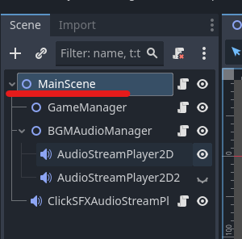
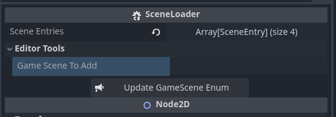
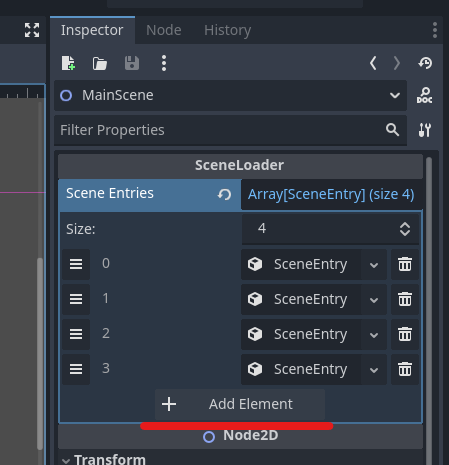
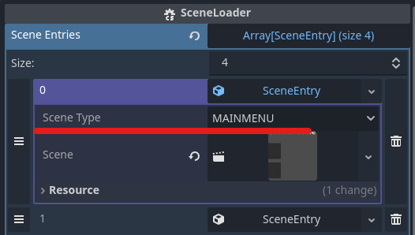
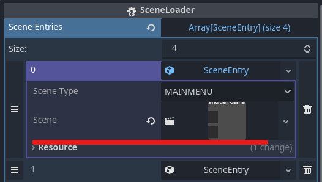
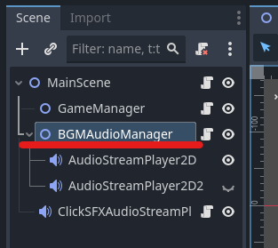
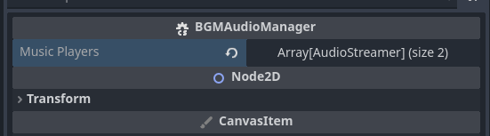
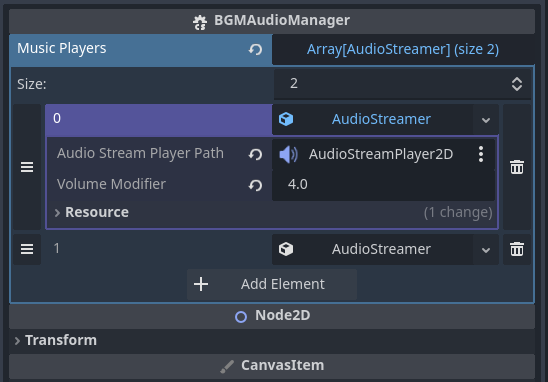
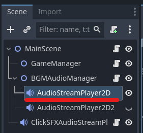
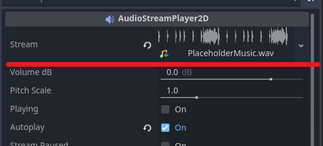

# godot-game-template
Note: This readme is intended to be read in MarkDown.

This project contains the following:
 - A simple main menu
 - A game scene loading system to avoid recursive refrencing when loading game scenes
 - A settings system with the following settings
   - Master volume
   - Music volume
   - Effects volume
   - Windowed/Fullscreen
   - Screen Resolutions (16:9 resoulutions)
 - Persistance of settings


### Adding a new loadable game scene
1: Open MainScene.tscn found at res://Scenes/Administritive/MainScene.tscn

2: Select MainScene in the hirachy 



3: In the Inspector under SceneLoader, open the subgroup "Editor Tools", write the name of the scene in "Game Scene To Add" and press "Update GameScene Enum".



4: In the Inspector under SceneLoader, add a new element to the Scene Entries array

5: Add a new Scene Entry in the new element



6: Open the new Scene Entry

7: Set Scene Type to the scene name added in step 3



8: Drag the related .tscn file into the Scene variable



### Handling of Audio Source
#### AudioMaster
In settings there are 3 different slideres to adjust for the game's sound (Master, Music and Effects). The Master volume is intended to effect all sound in the game, while Music is intended to effect game music and Effects is intended to effect sound effects. This means that all sound in the game will be effected by two volume settings (or more). To handle this the AudioMaster class has been made. To get the music volume you can call `AudioMaster.GetMusicVolume()` and likewise with effects volume `AudioMaster.GetSFXVolume()`. Additionally, not all sounds have the same baseline volume, so to help with that you can add a modifier to the call, which will scale the volume, `AudioMaster.GetMusicVolume(2.5f)`.
Example for BGMAudioManager.cs
```
foreach (var player in musicPlayers)
{
    AudioStreamPlayer2D player2D = player.AudioPlayer2D;
    if (player2D == null) { continue; }
    player2D.VolumeDb = AudioMaster.GetMusicVolume(player.volumeModifier);
}
```

#### BGMAudioManager
Stands for: Background Music Audio Manager
Usually you will want one or more pieces of background music/sound running at the same time, the BGMAudiomanager helps with that as well as ensuring the audio volume updates when the settings are changed.

The BGMAudioManager has an array of AudioStreamers in which you can assign an AudioStreamPlayer2D and a volume modifier for that AudioStreamPlayer2D.

To add your own music to the BGMAudioManager, open the MainScene.tscn (res://Scenes/Administritive/MainScene.tscn), select the BGMAudioManager in the hierachy



Then open the Music Player array in the inspector



Then add your AudioStreamPlayer2D to a new or existing AudioStreamer.




Changing the music played can either be done manually in the editor, by selecting a AudioStreamPlayer2D in the hierachy



and replace the stream variable in the inspector



### Change screen resolutions available in settings
Currently a handful of 16:9 screen resolutions are available in the settings menu. However, if you wish to use/offer other screen resolutions, then they can be added by going to the SettingsMenuManager.cs (res://Scripts/Administrative/SettingsMenuManager.cs), find the "availableResolutions" array and add/remove any screen resolutions you wish. The first parameter is screen width and the second parameter is screen height.
